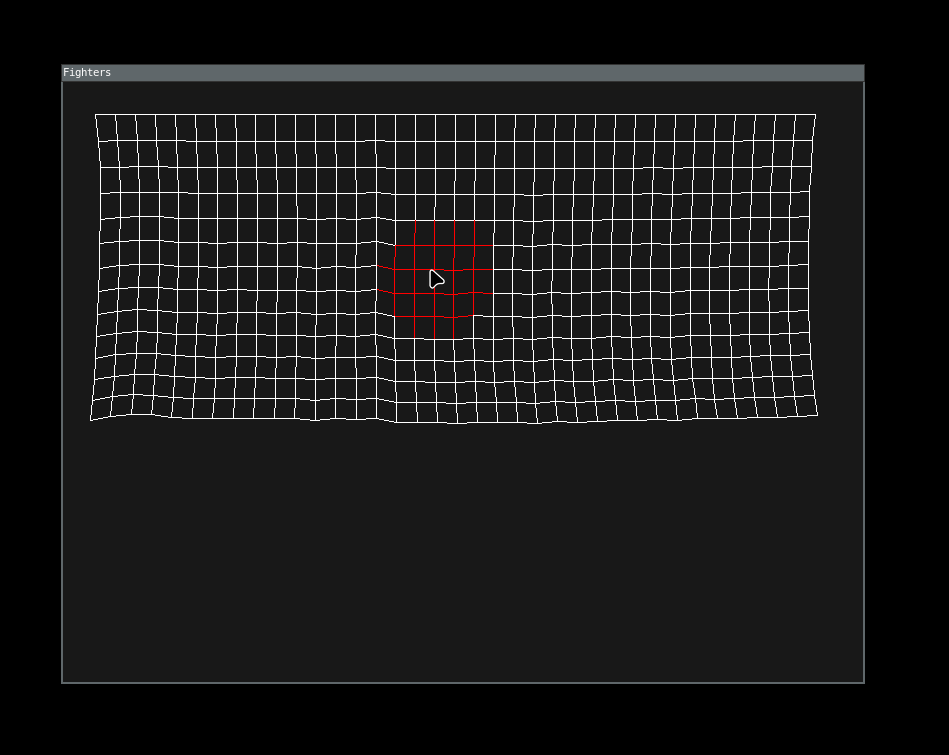

# Fisiks Sims
fisiks. 

### Preview
<center></center>

### Quick Start
```
    $ pip install -r requirements.txt
    $ python3 main.py
```

### Sources
- [Verlet Integration and Cloth Physics Simulation](https://pikuma.com/blog/verlet-integration-2d-cloth-physics-simulation)